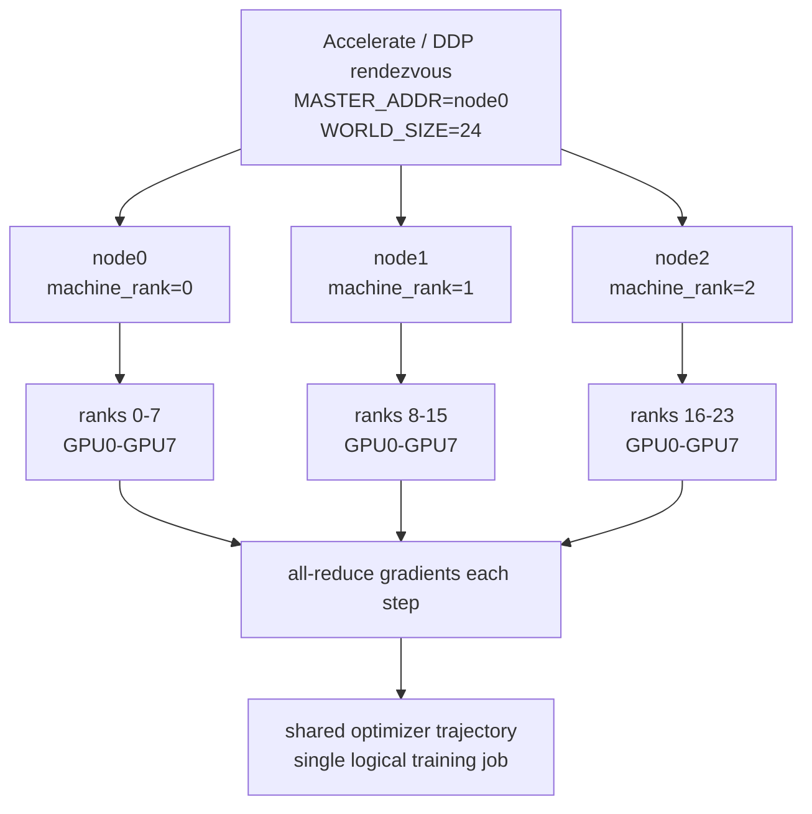
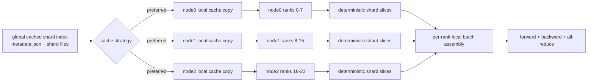
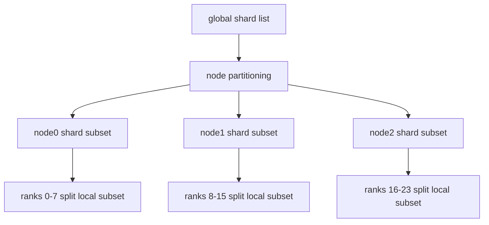
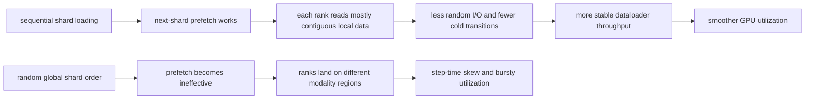

# 3-Node x 8-GPU Training Plan

This document sketches the recommended deployment plan for the datacenter tri-encoder training path on 3 nodes with 8 GPUs each, for a total world size of 24.

The target workload is the cached mmBERT + SigLIP2 + Whisper training path driven by [configs/train_server_datacenter_8gpu_cached.yaml](./configs/train_server_datacenter_8gpu_cached.yaml) and [scripts/train_st_multimodal.py](./scripts/train_st_multimodal.py).

## Recommended Strategy

Use plain multi-node DDP through Accelerate first.

- keep the current custom tri-encoder trainer
- keep sequential shard loading enabled
- keep global shard shuffle disabled until shard balancing is improved
- store cached shards on node-local NVMe or SSD on every node
- partition work across all 24 ranks, not just within each node

DeepSpeed is optional for later memory or optimizer-state scaling, but it is not the primary answer for multi-node cache loading.

## Cluster Layout

Assume:

- 3 nodes
- 8 GPUs per node
- 1 process per GPU
- `WORLD_SIZE=24`

Suggested rank layout:

| Node | Local GPUs | Global ranks |
| --- | --- | --- |
| node0 | 8 | 0-7 |
| node1 | 8 | 8-15 |
| node2 | 8 | 16-23 |

Use one rendezvous endpoint on node0:

- `MASTER_ADDR=node0`
- `MASTER_PORT=29500`

### Diagram: Training Distribution Across 3 Nodes



## Data And Cache Plan

The main rule is simple: model state can be distributed, but data locality must be designed explicitly.

Recommended layout:

1. Build or copy the cached shard dataset onto local storage on each node.
2. Mount the same in-container path on every node, for example `/scratch/2dmse-data/server_full/cache`.
3. Keep shard metadata identical across nodes.
4. Let each rank read directly from its local node storage.

Avoid:

- one shared NFS path for all 24 ranks when local storage is available
- rank 0 reading batches and broadcasting them for this cached workload
- per-node ad hoc shard lists that break global rank accounting

If the full cache is too large to replicate to all nodes, use this fallback:

1. split shard IDs into 3 node-level partitions
2. copy only that node partition to local storage on each node
3. inside each node, split the local partition again across the 8 local ranks

### Diagram: Data, Rank, And Shard Assignment



Fallback when full replication is too large:



## Sharding And Shuffle Plan

For this repo, the safest starting point is deterministic shard order.

Why:

- cached shard regions are not uniformly mixed by modality
- earlier testing already showed that global shard shuffle can produce poor per-rank modality balance
- sequential shard loading is what makes shard prefetch useful

Recommended behavior for the first 24-GPU rollout:

- `sequential_shard_loading: true`
- `shuffle: false`
- each rank consumes a different slice of the same global shard order
- all ranks agree on the same epoch boundary

Only introduce shuffle after adding a balancing layer such as:

- shard buckets stratified by modality mix
- node-stable shuffled shard groups
- epoch-wise shard permutation that remains globally synchronized across ranks

If shuffle is later enabled through a distributed sampler or seedable sampler, reseed once per epoch so all ranks derive the same new ordering.

### Diagram: Why This Improves GPU Utilization



Operational interpretation:

- local storage removes cross-node filesystem bottlenecks
- deterministic shard order keeps ranks in comparable workload regions
- sequential access gives worker-local shard prefetch something useful to do
- more consistent input readiness reduces idle gaps between compute steps

## Accelerate Plan

Accelerate is the preferred first implementation because the current trainer already uses it.

Use it in a way that preserves per-rank direct reads:

- prefer sharded dataloaders over dispatch-style loading
- avoid `dispatch_batches` for this heavy cached dataset unless there is a special reason
- keep sampler behavior globally deterministic
- use pinned memory only if host-to-device transfer profiling shows benefit in this ROCm environment

Operationally, each node should launch the same training command with its own machine rank.

Example shape:

```bash
accelerate launch \
  --num_machines 3 \
  --machine_rank ${MACHINE_RANK} \
  --main_process_ip ${MASTER_ADDR} \
  --main_process_port ${MASTER_PORT} \
  --num_processes 8 \
  /workspace/app/scripts/train_st_multimodal.py \
  --config /workspace/app/configs/train_server_datacenter_8gpu_cached.yaml
```

Practical note:

- `num_processes` here is per machine for the launch command shape above
- total process count is 24 across the cluster

## DeepSpeed Plan

Do not start with DeepSpeed for this rollout unless memory pressure forces it.

Use DeepSpeed later if you need:

- optimizer-state sharding
- larger effective batch sizes
- ZeRO-based memory relief

Do not expect DeepSpeed to solve:

- node-local cache placement
- remote filesystem contention
- incorrect shard-order or sampler semantics

If DeepSpeed is introduced later, keep the same data policy:

- local cache per node
- deterministic global rank partitioning
- sampler or shard assignment synchronized across all 24 ranks

## Launch Checklist

Before launch:

1. verify passwordless SSH or the chosen launcher method across the 3 nodes
2. verify identical container image and repo state on all nodes
3. verify the cache path exists locally on every node
4. verify `MASTER_ADDR`, `MASTER_PORT`, `WORLD_SIZE`, `RANK`, and `LOCAL_RANK`
5. verify RCCL and network environment variables are consistent across nodes

At launch time:

1. start node0 first or ensure rendezvous is reachable
2. start all 3 nodes with the same config and only different machine rank values
3. confirm 24 worker processes join the same job
4. confirm the first few steps show balanced throughput across ranks

After launch:

1. watch step time skew by rank
2. watch host I/O and filesystem wait on each node
3. watch whether one node lags during shard transitions
4. validate checkpoint creation from the shared output path

## Rollout Stages

Use this order instead of jumping directly to a long production run.

### Stage 1: 1 node x 8 GPUs

- confirm the current cached config still behaves well
- record baseline step time and utilization

### Stage 2: 2 nodes x 8 GPUs

- validate rendezvous and cross-node cache reads
- confirm no major skew between node0 and node1

### Stage 3: 3 nodes x 8 GPUs

- run a short smoke job first
- verify synchronized startup, stable step times, and checkpointing
- only then start the longer production run

## Success Criteria

The rollout is healthy if:

- all 24 ranks join consistently
- no node reads primarily from remote storage
- step times remain close across nodes
- GPU utilization stays materially smoother than the earlier random-shard pattern
- checkpoint and resume work without rank mismatches

## Recommended First Version

For the first real 3-node run, use this exact policy:

- Accelerate multi-node DDP
- current cached tri-encoder trainer
- local cache copy on every node
- sequential shard loading enabled
- shuffle disabled
- one process per GPU
- short smoke run before the full training job

That is the lowest-risk plan that matches what this repository already proved locally.